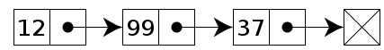

# Linked Lists

A linked list is an abstract data structure, it is a linear representation of a data set. We could understand the structure as a collection of **nodes**, connecteds in a sequence, each node stores two pieces of information, the first is the *key or data*, this value is the type of information we want to analyze, it can be an integer, a character or any other type of data; the second is a pointer, which saves the address to the position of another node in memory, we could see it as a link that connects all the elements within the structure.

A list is a different way of storing data and, like any other type, has advantages and disadvantages. Let's compare the list with arrays because at the moment they are the structures most familiar to me. An array must allocate a contiguous amount of space in memory, each element of the array must be indexed according to its position and the elements are located in the same position in memory, adjacent elements have adjacent addresses, which makes some actions costly in relation to the time needed to execute them, as  insert and delete elements. To add a new element or remove an existing element from an array, we must reallocate all the space in memory, add the new space and also correct the indexes for each element.

Performing these actions in a list is a relatively easy task, we are able to insert or remove any element in any position with the same number of movements, as a list is a dynamic structure, we can also allocate or free memory for the elements in demand, this means, only when these actions are necessary.Therefore, when compared to a matrix, the main advantages of a list are:
- Dynamic size, allocate or free up amounts of space in memory easily.
- As a consequence of the previous fact, lists facilitate operations such as inserting or deleting elements.

Lists also have some disadvantages when compared to arrays, as they do not allow random access to elements, for example, in a list, if we want to obtain the value on the nth node, because the elements are connected by pointers and do not need to be allocated in the same memory location, we would need to go through all the nodes before reaching the nth position. Since lists store two values, data and pointers, they also need larger memory blocks to save the information for each element. We could sumaryse it by:
- Random access is not allowed, we need to access the elements sequentially, which limits the search algorithms.
- Extra memory space required due to pointers for each element.

We can use linked lists to implement other data structures, which have the same constructions as lists, but differ in the way elements are placed and removed from the structure. Here, we will see 2 examples, **Stacks** and **Queues**.

The *"Stacks"* must obey the **LIFO** condition (Last In First Out) to place and remove their elements, to facilitate understanding, we could imagine a real pile of dishes, where we place the dishes on top of each other. If we want to take one of these dishes, we need to remove the dish at the top of the pile, which was the last dish added, that is, so that the last item added is the first item removed.

Otherwise, the *"Queues"* must follow the **FIFO** restriction (First In, First Out) to insert and remove elements. We can see this as a queue of people in a Music Show, the first person to enter the queue must be the first to enter the show,it means to leave the queue , and the last person in the queue must wait until everyone in front of her enters the show before she can enter the show.

To better understand the peculiarities of each of the data structures, please consult the available source code.